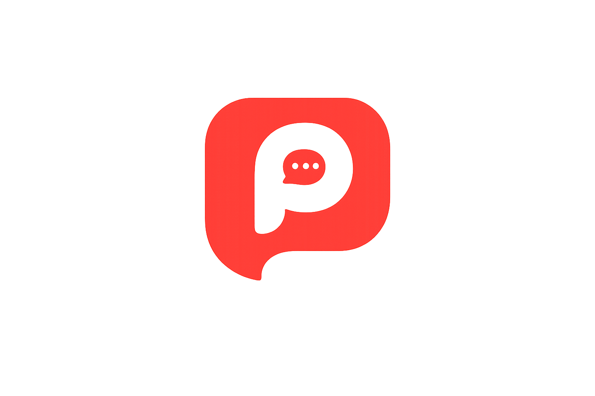

# PandaPost Landing Page - Quick Start Guide

## Getting Started in 5 Minutes

### 1. View the Page
Simply open `index.html` in your web browser:
- Windows: Double-click `index.html`
- Mac: Right-click → Open With → Browser
- Or drag the file into your browser window

### 2. Make Your First Edit
Open `index.html` in any text editor and find this line (around line 38):
```html
<h1 class="hero-title">
    Manage Social Media Smarter.<br>
    <span class="gradient-text">Grow Faster.</span>
</h1>
```
Change the text, save, and refresh your browser to see the changes.

### 3. Change Colors
Open `styles.css` and modify the color variables at the top:
```css
:root {
    --primary-red: #FF4B3E;    /* Change this to your brand color */
    --dark-navy: #0F172A;
    --orange: #FF8A00;
    /* etc. */
}
```

## File Overview

```
Pandapost/
├── index.html                    # Main page structure
├── styles.css                    # All styling (4000+ lines)
├── script.js                     # Interactive features
├── README.md                     # Full documentation
├── CONVERSION_STRATEGY.md        # Marketing strategy
├── LAUNCH_CHECKLIST.md           # Pre-launch tasks
└── assets/logo/                  # Brand images
```

## Common Tasks

### Update a CTA Link
Find all instances of `/demo` or `/signup` in `index.html` and replace with your actual URLs:

```html
<!-- Change this -->
<a href="/demo" class="btn btn-primary">Book a Demo</a>

<!-- To this -->
<a href="https://app.pandapost.com/demo" class="btn btn-primary">Book a Demo</a>
```

### Add a New Section
Copy an existing section structure and modify:

```html
<section class="your-section">
    <div class="container">
        <h2 class="section-title">Your Title</h2>
        <p class="section-description">Your description</p>
        <!-- Your content -->
    </div>
</section>
```

Don't forget to add styling in `styles.css`:

```css
.your-section {
    padding: 100px 0;
    background: var(--white);
}
```

### Change Button Styles
Buttons use these classes:
- `.btn-primary` - Red button (main CTA)
- `.btn-secondary` - White button with red border
- `.btn-white` - White button (for dark backgrounds)
- `.btn-large` - Bigger size

Example:
```html
<a href="/demo" class="btn btn-primary btn-large">Book a Demo</a>
```

### Update Images
Replace image paths in `index.html`:

```html
<!-- Navigation logo -->


<!-- Hero mascot -->


<!-- Demo section mascot -->

```

Just replace the files in `assets/logo/` with your new images (keep the same names, or update the paths).

## Responsive Design

The page automatically adjusts to screen sizes:
- **Mobile**: < 768px (stacked layout, full-width buttons)
- **Tablet**: 768px - 1024px (mixed layout)
- **Desktop**: > 1024px (full two-column layout)

To test responsive design:
1. Open page in Chrome
2. Press `F12` for DevTools
3. Click device icon (or `Ctrl+Shift+M`)
4. Select different devices from dropdown

## Key CSS Classes

### Layout
- `.container` - Max-width 1280px, centered
- `.hero-container` - Two-column grid
- `.section-title` - Large heading style
- `.section-description` - Paragraph style

### Components
- `.btn` - Base button style
- `.feature-card` - Feature box with hover effect
- `.workflow-step` - Workflow circle
- `.float-card` - Floating animated card

### Colors
- `.gradient-text` - Red to orange text gradient
- Use CSS variables: `var(--primary-red)`, `var(--dark-navy)`, etc.

## Adding Analytics

### Google Analytics
Add this before `</head>` in `index.html`:

```html
<!-- Google Analytics -->
<script async src="https://www.googletagmanager.com/gtag/js?id=GA_MEASUREMENT_ID"></script>
<script>
  window.dataLayer = window.dataLayer || [];
  function gtag(){dataLayer.push(arguments);}
  gtag('js', new Date());
  gtag('config', 'GA_MEASUREMENT_ID');
</script>
```

### Event Tracking
CTA clicks are already logged in `script.js`. To send to analytics, uncomment and modify:

```javascript
// In script.js, find this section and uncomment:
// gtag('event', 'cta_click', { button_text: buttonText });
```

## Integrating Forms

### Simple Contact Form Example

```html
<form class="demo-form" action="/submit-demo" method="POST">
    <input type="text" name="name" placeholder="Full Name" required class="form-input">
    <input type="email" name="email" placeholder="Email Address" required class="form-input">
    <input type="text" name="company" placeholder="Company Name" class="form-input">
    <button type="submit" class="btn btn-primary btn-large">Book Your Demo</button>
</form>
```

Add styling:
```css
.form-input {
    width: 100%;
    padding: 14px 20px;
    border: 2px solid #E5E7EB;
    border-radius: 10px;
    font-size: 16px;
    margin-bottom: 16px;
}

.form-input:focus {
    outline: none;
    border-color: var(--primary-red);
}
```

## Performance Tips

### Optimize Images
Use online tools to compress images:
- [TinyPNG](https://tinypng.com/) - PNG compression
- [Squoosh](https://squoosh.app/) - All formats
- Convert to WebP for better compression

### Minify for Production
Before launching, minify your files:
- CSS: Use [CSS Minifier](https://cssminifier.com/)
- JS: Use [JavaScript Minifier](https://javascript-minifier.com/)

### Enable Caching
Add this to your `.htaccess` file (Apache) or configure in your hosting:
```apache
<IfModule mod_expires.c>
  ExpiresActive On
  ExpiresByType image/png "access plus 1 year"
  ExpiresByType text/css "access plus 1 month"
  ExpiresByType application/javascript "access plus 1 month"
</IfModule>
```

## Testing Checklist

Before showing to anyone:
1. [ ] Open in Chrome, Firefox, Safari
2. [ ] Test on mobile device (real device is best)
3. [ ] Click every button and link
4. [ ] Check spelling and grammar
5. [ ] Verify all images load
6. [ ] Test forms (if added)
7. [ ] Check page load speed (< 3 seconds)

## Troubleshooting

### Images Don't Load
- Check file paths are correct
- Check file names match exactly (case-sensitive)
- Verify images exist in `assets/logo/`

### Styles Look Wrong
- Make sure `styles.css` is in the same folder as `index.html`
- Check browser console (F12) for errors
- Try hard refresh: `Ctrl+Shift+R` (Windows) or `Cmd+Shift+R` (Mac)

### Mobile Menu Won't Work
- Check that `script.js` is loading
- Open browser console for JavaScript errors
- Make sure you didn't modify the IDs in HTML

### Animations Not Working
- Some animations require page scroll
- Check browser console for errors
- Try in a different browser

### Buttons Not Clickable
- Check for overlapping elements
- Verify `z-index` values
- Check if JavaScript is enabled

## Need Help?

1. **Read the full documentation**: Check `README.md`
2. **Review conversion strategy**: See `CONVERSION_STRATEGY.md`
3. **Check launch tasks**: Review `LAUNCH_CHECKLIST.md`
4. **Browser DevTools**: Press F12 to inspect elements and see errors
5. **View source code comments**: Both CSS and JS have helpful comments

## Quick Reference: File Sizes

Typical file sizes (for reference):
- `index.html`: ~20KB
- `styles.css`: ~30KB (minified: ~20KB)
- `script.js`: ~5KB (minified: ~3KB)
- Logo images: Should be < 100KB each
- Mascot images: Should be < 200KB each

If your page is loading slowly, images are usually the culprit.

## Next Steps After Setup

1. **Customize Content**: Update all text to match your messaging
2. **Update Routes**: Change `/demo` and `/signup` to real URLs
3. **Add Analytics**: Install tracking code
4. **Test Thoroughly**: Check all devices and browsers
5. **Optimize Images**: Compress all assets
6. **Deploy**: Upload to your web hosting
7. **Monitor**: Watch analytics and user behavior

## Pro Tips

### Keyboard Shortcuts for Development
- `Ctrl+Shift+I` - Open DevTools
- `Ctrl+Shift+M` - Toggle device mode (responsive testing)
- `Ctrl+Shift+R` - Hard refresh (clear cache)
- `Ctrl+U` - View page source
- `Ctrl+F` - Find in file

### Browser DevTools Tabs
- **Elements**: Inspect HTML and CSS
- **Console**: See JavaScript errors
- **Network**: Check loading times
- **Performance**: Analyze page speed
- **Application**: Check storage and cache

### CSS Quick Edits
Want to try a color before editing the file?
1. Press F12 in browser
2. Click "Elements" tab
3. Click any element
4. Edit CSS in the Styles panel
5. Once you like it, copy to your actual CSS file

---

**You're all set!** Open `index.html` in your browser and start customizing.

For questions, refer to the documentation files in this folder.
